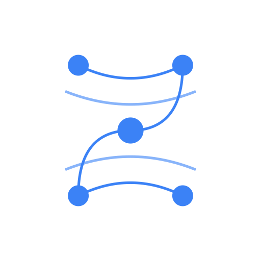

# @framers/openstrand-sdk

<p align="center">
  <a href="https://github.com/framersai/openstrand-monorepo">
    
  </a>
</p>

<p align="center">
  Official TypeScript SDK for the OpenStrand API. Works in Node.js and modern browsers, ships with full type coverage, and mirrors backend contracts.
</p>

<p align="center">
  <a href="https://www.npmjs.com/package/@framers/openstrand-sdk">
    
  </a>
  <a href="https://www.npmjs.com/package/@framers/openstrand-sdk">
    
  </a>
  <a href="https://github.com/framersai/openstrand-monorepo/actions/workflows/test.yml">
    
  </a>
  <a href="https://github.com/framersai/openstrand-sdk/actions/workflows/release.yml">
    
  </a>
  <a href="https://github.com/framersai/openstrand-sdk/actions/workflows/publish.yml">
    
  </a>
  <a href="https://github.com/framersai/openstrand-monorepo/blob/master/packages/openstrand-sdk/LICENSE">
    
  </a>
  
  
  <a href="https://bundlephobia.com/package/@framers/openstrand-sdk">
    
  </a>
  <a href="https://codecov.io/gh/framersai/openstrand-sdk">
    
  </a>
  <a href="https://github.com/framersai/openstrand-monorepo">
    
  </a>
  
</p>

---

## Installation

```bash
npm install @framers/openstrand-sdk
# or
yarn add @framers/openstrand-sdk
# or
pnpm add @framers/openstrand-sdk
```

---

## Quick Start

```ts
import { OpenStrandSDK } from '@framers/openstrand-sdk';

const sdk = new OpenStrandSDK({
  apiUrl: process.env.OPENSTRAND_API_URL ?? 'http://localhost:8000',
});

// Authenticate (local mode)
const { token } = await sdk.auth.login({
  username: 'demo',
  password: 'Demo123!',
});

sdk.setToken(token);

// Create a strand
const strand = await sdk.strands.create({
  type: 'document',
  title: 'Knowledge Graph Notes',
  content: { markdown: '# Connections' },
  tags: ['knowledge', 'graph'],
});

console.info('strand-id', strand.id);
```

---

## Features

- **TypeSafe** – generated TypeScript definitions line up with backend validation.
- **Isomorphic** – works in Node, browsers, and serverless runtimes.
- **Configurable** – retry/backoff, custom headers, and request hooks.
- **Error-aware** – throws descriptive error classes (`AuthenticationError`, `ValidationError`, etc.).
- **Tree-shakeable** – imports only what you need.

---

## Visualizations

Create, list, update, delete, export, and inspect tier availability.

```ts
import { OpenStrandSDK } from '@framers/openstrand-sdk';

const sdk = new OpenStrandSDK({ apiUrl: 'http://localhost:8000' });

// Create from a prompt (optionally attach a datasetId and tier)
const viz = await sdk.visualizations.create({
  prompt: 'Bar chart of revenue by month',
  datasetId: 'ds_123',
  tier: 1,
});

// Paginate list
const { items } = await sdk.visualizations.list({ page: 1, pageSize: 20 });

// Update
const updated = await sdk.visualizations.update(viz.id, { options: { color: 'teal' } });

// Export (Blob)
const svg = await sdk.visualizations.export(viz.id, 'svg');

// Delete
await sdk.visualizations.delete(viz.id);

// Tier info
const tiers = await sdk.visualizations.tierInfo();
```

---

## Data & Feedback

```ts
// Upload a dataset
const { datasetId, metadata } = await sdk.data.upload(file);

// Summary and preview
const summary = await sdk.data.summary(datasetId);
const preview = await sdk.data.preview(datasetId, 20);

// Schema intelligence
const schema = await sdk.data.schema(datasetId);

// Prompt a visualization for the dataset
const viz = await sdk.data.visualize(datasetId, 'Line chart of sales by day');

// Feedback
await sdk.feedback.upvote(viz.id);
const fb = await sdk.feedback.summary(viz.id);
```

---

## Meta, Featured, Teams & Domains, Weave Advanced

```ts
// Meta and docs links
const meta = await sdk.meta.developer();

// Featured/leaderboard
const featured = await sdk.featured.list();
const leaderboard = await sdk.featured.leaderboard({ period: 'week', limit: 10 });

// Team API tokens (Team+)
const tokens = await sdk.teams.tokens.list();

// Custom domains (Team+)
await sdk.teams.domains.add({ teamId: 't_123', domain: 'example.com' });

// Weave (graph) advanced
const segment = await sdk.weaveAdvanced.graph('weave_123', { cluster: true, limit: 200 });
const paths = await sdk.weaveAdvanced.findPaths('weave_123', 'nodeA', 'nodeB', 4);
```

---

## Configuration Options

```ts
const sdk = new OpenStrandSDK({
  apiUrl: 'http://localhost:8000',
  token: process.env.OPENSTRAND_TOKEN, // optional
  timeout: 30_000,
  retry: {
    enabled: true,
    maxRetries: 3,
    retryDelay: 1_000,
  },
  headers: {
    'X-Client': 'openstrand-cli',
  },
});
```

`apiUrl` is required. All other fields are optional.

---

## Error Handling

```ts
import { AuthenticationError, NetworkError } from '@framers/openstrand-sdk';

try {
  await sdk.auth.login({ username: 'demo', password: 'wrong-pass' });
} catch (error) {
  if (error instanceof AuthenticationError) {
    console.error('Invalid credentials');
  } else if (error instanceof NetworkError) {
    console.error('Network issue:', error.cause);
  } else {
    console.error('Unexpected error', error);
  }
}
```

All API methods throw typed errors, making it easy to provide user-friendly messages.

---

## Browser Usage

```html
<script type="module">
  import { OpenStrandSDK } from 'https://cdn.jsdelivr.net/npm/@framers/openstrand-sdk/+esm';

  const sdk = new OpenStrandClient({
    apiUrl: 'https://api.openstrand.ai',
  });

  // ...
</script>
```

---

## API Docs (TypeDoc)

Generate HTML docs from TSDoc comments:

```bash
npm install
npm run docs
# output: packages/openstrand-sdk/docs/
```

---

## Release Automation

- The `release sdk` GitHub Action (`.github/workflows/release.yml`) runs on every push to `master`/`main`.
- semantic-release analyzes commits, bumps the version, generates release notes, and publishes to npm.
- Publishing uses **npm Trusted Publishing (OIDC)** – no long-lived `NPM_TOKEN` secrets are stored in CI.
- Provenance metadata is enabled via `publishConfig.provenance = true`, so every npm release is signed by GitHub.
- A dedicated `Publish to npm` workflow listens for the GitHub Release event and handles `npm publish --provenance`. You can also run it manually from the Actions tab by passing an existing tag (e.g., `v0.2.0`).

Manual fallback (maintainers only):

```bash
yarn install
yarn build
npm publish --access public --provenance
```

If you need to publish locally, ensure your npm account has access to `@framers/*` and that 2FA is set to **Authorization only** or you are using a granular publish token with bypass 2FA enabled.

## Links

- Repository: https://github.com/framersai/openstrand-monorepo
- Issues: https://github.com/framersai/openstrand-monorepo/issues
- Documentation: https://github.com/framersai/openstrand-monorepo/tree/master/docs

---

---

## Learning & Spaced Repetition (v1.3+)

### Flashcards

```ts
// Create flashcard
const card = await sdk.learning.createFlashcard({
  front: { text: 'What is a qubit?' },
  back: { text: 'A quantum bit - basic unit of quantum information' },
  deck: 'Quantum Computing',
  tags: ['quantum', 'physics']
});

// Generate flashcards from strand (with templates)
const cards = await sdk.learning.generateFlashcards('strand-123', {
  count: 10,
  template: 'cloze', // definition, cloze, qa, image_recall, dataset_numeric, minimal, auto
  complexity: 3, // 1-5 scale
  allowImages: true
});

// Get due cards for study
const dueCards = await sdk.learning.getDueFlashcards({ deck: 'Biology', limit: 20 });

// Record study (updates spaced repetition)
const updated = await sdk.learning.recordStudy({
  flashcardId: 'card-123',
  rating: 'good', // again, hard, good, easy
  timeSpentMs: 5000
});

console.log(`Next review in ${updated.interval} days`);
```

### Quizzes

```ts
// Generate quiz from strands
const quiz = await sdk.learning.generateQuiz(['strand-1', 'strand-2'], {
  questionCount: 10,
  template: 'mixed_depth', // mcq_overview, mixed_depth, concept_check, practical_code, minimal, auto
  complexity: 3,
  allowImages: true
});

// Start quiz attempt
const attempt = await sdk.learning.startQuizAttempt('quiz-123');

// Submit answers
const results = await sdk.learning.submitQuizAttempt(attempt.attemptId, [
  { questionId: 'q1', answer: 'A', timeSpentMs: 5000 },
  { questionId: 'q2', answer: 'true', timeSpentMs: 3000 }
]);

console.log(`Score: ${results.score}% | Passed: ${results.passed}`);
```

---

## Adaptive Learning (v1.4)

### Adaptive Quiz (Leitner System)

```ts
// Start adaptive session
const session = await sdk.learning.startAdaptiveSession('quiz-123');
console.log('First question:', session.firstQuestion);
console.log('Progress:', session.progress); // bucket0: 5, bucket1: 3, etc.

// Record answer (updates Leitner buckets)
const result = await sdk.learning.recordAdaptiveAnswer('quiz-123', {
  questionId: 'q1',
  isCorrect: true,
  timeSpentMs: 5000
});

console.log(`Moved to bucket ${result.newBucket}`);
console.log('Next question:', result.nextQuestion);

// Get "Explain Why" tutoring
const explanation = await sdk.learning.explainAnswer('quiz-123', {
  questionId: 'q1',
  userAnswer: 'B',
  mode: 'socratic' // concise, detailed, socratic
});

console.log(explanation.explanation);
```

### Socratic Insights

```ts
// Generate Socratic questions for any content
const insights = await sdk.learning.generateSocraticInsights({
  contentId: 'strand-123',
  contentType: 'strand', // flashcard, quiz, strand, loom, weave
  depth: 'deep', // quick, medium, deep
  focusArea: 'causality',
  maxQuestions: 7
});

console.log('Socratic questions:', insights.questions);
console.log('Reflection prompts:', insights.reflectionPrompts);
console.log('Deeper topics:', insights.deeperTopics);
console.log(`Cost: $${insights.cost}`);
```

---

## Productivity & Pomodoro (v1.3)

### Pomodoro Timer

```ts
// Start session
const session = await sdk.pomodoro.start({
  preset: 'classic', // classic (25min), short (15min), long (50min), custom
  label: 'Deep work on algorithms',
  strandId: 'strand-123'
});

// Pause/resume
await sdk.pomodoro.pause(session.id);
await sdk.pomodoro.resume(session.id);

// Complete
await sdk.pomodoro.complete(session.id, 'Very productive!');

// Get stats
const stats = await sdk.pomodoro.getStats(30);
console.log(`${stats.totalSessions} sessions, ${stats.totalMinutes} minutes`);
```

### Productivity Analytics

```ts
// Get dashboard
const dashboard = await sdk.productivity.getDashboard();
console.log(`Current streak: ${dashboard.streaks.current} days`);
console.log(`Today's study time: ${dashboard.today.studyMinutes}min`);

// Get streak history (for GitHub-style heatmap)
const history = await sdk.productivity.getStreakHistory(365);

// Get insights
const insights = await sdk.productivity.getInsights();
insights.forEach(insight => {
  console.log(`${insight.type}: ${insight.message}`);
});
```

---

## Gamification (v1.4)

### Badges & Achievements

```ts
// List all badges (with progress)
const badges = await sdk.gamification.listBadges();
const earned = badges.filter(b => b.earned);

// Get user's earned badges
const myBadges = await sdk.gamification.getUserBadges();

// Check and auto-award badges
const newBadges = await sdk.gamification.checkBadges();
if (newBadges.length > 0) {
  console.log('New badges earned:', newBadges.map(b => b.name));
}
```

### Leaderboards

```ts
// Get team leaderboard
const leaderboard = await sdk.gamification.getLeaderboard('team-123', {
  category: 'overall', // overall, flashcards, quizzes, pomodoro, streak
  period: 'weekly', // weekly, monthly, all_time
  limit: 50
});

// Opt in/out
await sdk.gamification.optInLeaderboard('team-123');
await sdk.gamification.optOutLeaderboard('team-123');

// Get user's position
const position = await sdk.gamification.getUserPosition('team-123', {
  category: 'streak'
});
console.log(`You are rank #${position.rank} with ${position.score} points`);
```

### QR Code Sharing

```ts
// Create shareable link with QR code
const share = await sdk.gamification.createShare({
  contentId: 'quiz-123',
  contentType: 'quiz',
  isPublic: true,
  allowClone: true
});

console.log('Share URL:', share.shareUrl);
console.log('QR Code:', share.qrCodeUrl);
console.log('Short code:', share.shareCode);

// Get shared content
const shared = await sdk.gamification.getShare('abc123xy');

// Clone to your library
const cloned = await sdk.gamification.cloneShare('abc123xy');
console.log(`Cloned ${cloned.type}: ${cloned.id}`);
```

---

## Universal Export (v1.4)

Export any content type to multiple formats:

```ts
// Export flashcard deck to Anki
const ankiBuffer = await sdk.export.flashcardDeck('Biology', {
  format: 'anki',
  includeImages: true
});
await fs.writeFile('biology.apkg', ankiBuffer);

// Export quiz to PDF
const pdfBuffer = await sdk.export.quiz('quiz-123', {
  format: 'pdf',
  includeAnswers: true
});

// Export journal to Markdown
const mdBuffer = await sdk.export.journal('2024-01-01', '2024-12-31', {
  format: 'markdown',
  markdownFlavor: 'obsidian'
});

// Export strand (already supported)
const strandBuffer = await sdk.export.strand('strand-123', {
  format: 'docx',
  includeMetadata: true
});
```

**Supported formats**: PDF, DOCX, Markdown, HTML, JSON, CSV, PNG, Anki, ZIP

---

<p align="center">
  <strong>Built by</strong><br/>
  <a href="https://frame.dev">
    
  </a>
</p>

<p align="center">
  MIT © 2025 <a href="https://frame.dev">Framers</a>
</p>
